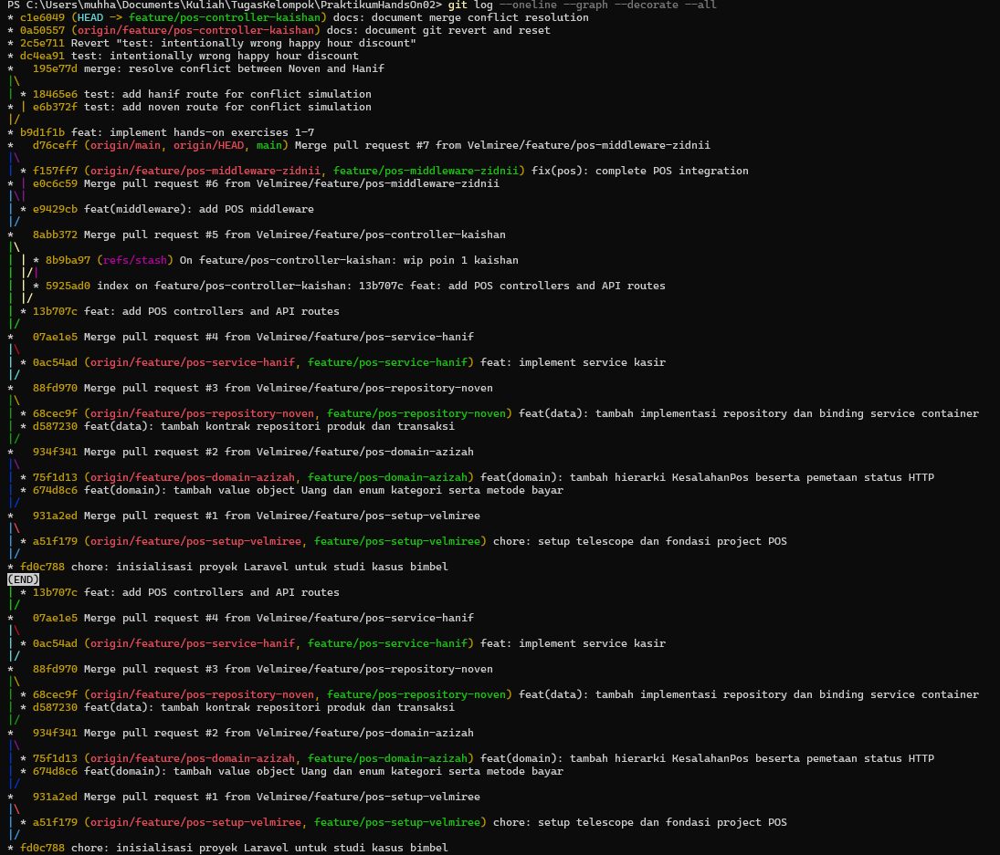

# Alur Git Tim

## Anggota dan Branch

| Anggota | Branch |
|---|---|
| Azizah | `feature/pos-domain-azizah` |
| Noven | `feature/pos-repository-noven` |
| Hanif | `feature/pos-service-hanif` |
| Kaishan | `feature/pos-controller-kaishan` |
| Zidnii | `feature/pos-middleware-zidnii` |

## Branch Kerja

Karena seluruh pengerjaan dilakukan menggunakan satu laptop, proses implementasi latihan dikerjakan secara bergantian pada satu branch kerja:

```text
feature/pos-controller-kaishan
```

## History Git

History Git digunakan untuk melihat urutan commit, proses merge, serta hubungan antarbranch dalam repository.

Perintah yang digunakan:

```bash
git log --oneline --graph --decorate --all



```

## Ringkasan Alur Git
Alur kerja Git tim dapat diringkas sebagai berikut:

Branch anggota
      ↓
Pengerjaan fitur
      ↓
Commit
      ↓
Penggabungan branch
      ↓
Penyelesaian conflict jika terjadi
      ↓
Pengujian hasil penggabungan
      ↓
Branch kerja terintegrasi
      ↓
Pemeriksaan history dengan git log